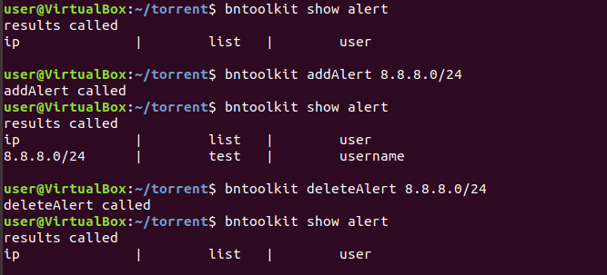
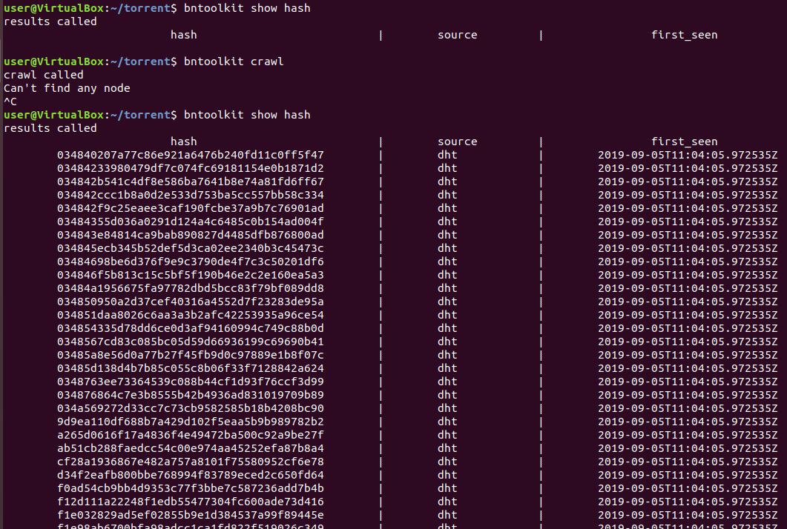
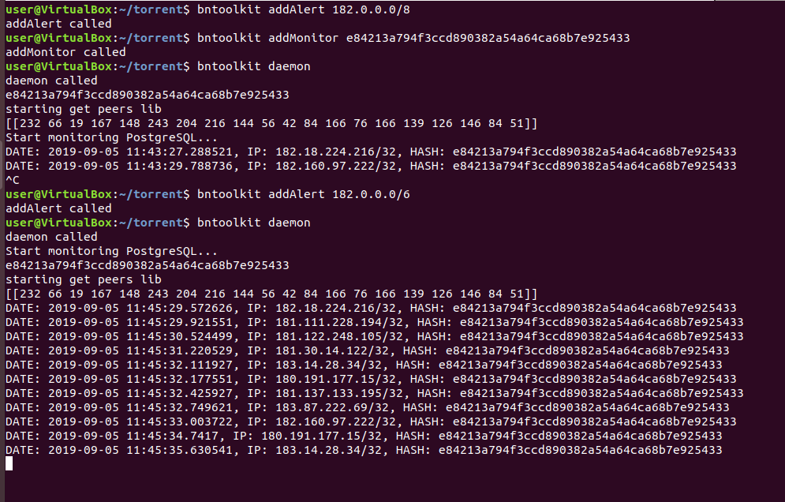
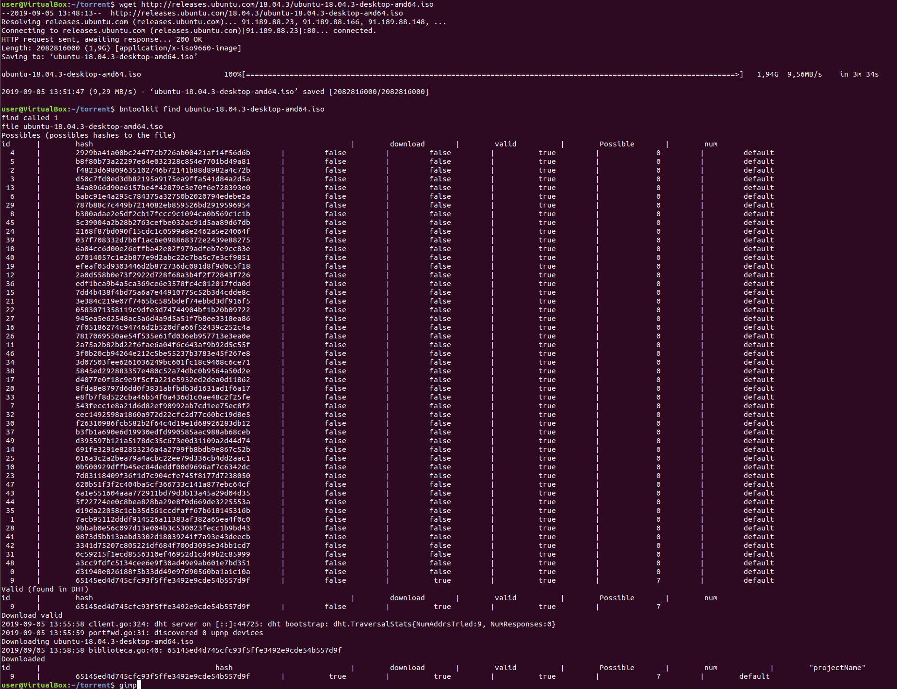

# BNToolkit (BitTorrent Network Toolkit)

- [BNToolkit](#bntoolkit)
    - [Install](#install)
        - [Install Docker](#install-docker)
        - [Get Docker image (RECOMMENDED)](#get-docker-image-recommended)
    - [Execute using Docker](#execute-using-docker)
        - [Create docker network](#create-docker-network)
        - [Start PostgreSQL](#start-postgresql)
        - [Exec bntoolkit](#exec-bntoolkit)
        - [Options](#options)
            - [Configure configFile.toml](#configure-configfiletoml)
            - [help](#help)
            - [version](#version)
            - [initDB](#initdb)
            - [create](#create)
            - [download](#download)
            - [getTorrent](#gettorrent)
            - [addAlert and deleteAlert](#addalert-and-deletealert)
            - [addMonitor and deleteMonitor](#addmonitor-and-deletemonitor)
            - [crawl](#crawl)
            - [daemon](#daemon)
            - [find](#find)
            - [insert](#insert)
                - [show](#show)
                - [hash](#hash)
                - [alert](#alert)
                - [count](#count)
                - [ip](#ip)
                - [monitor](#monitor)
                - [possibles](#possibles)
                - [project](#project)
    - [Manual install](#manual-install)
        - [Install Golang](#install-golang)
        - [Install bntoolkit](#install-bntoolkit)
            - [From github](#from-github)
            
## Theory and motivations (spanish)

- [Link TFG](https://ebuah.uah.es/dspace/bitstream/handle/10017/39532/TFG_Calvo_Laorden_2019.pdf?sequence=1&isAllowed=y)

## Install

### Install Docker

```bash
sudo apt install apt-transport-https ca-certificates curl software-properties-common
curl -fsSL https://download.docker.com/linux/ubuntu/gpg | sudo apt-key add -
sudo add-apt-repository "deb [arch=amd64] https://download.docker.com/linux/ubuntu bionic stable"
sudo apt update
sudo apt install docker-ce
```

REF: https://www.digitalocean.com/community/tutorials/como-instalar-y-usar-docker-en-ubuntu-18-04-1-es

### From [DockerHub](https://hub.docker.com/r/raulcalvolaorden/bntoolkit) (RECOMMENDED)

```bash
docker pull raulcalvolaorden/bntoolkit
```

## Execute using Docker

#### Create docker network
``` bash
sudo docker network create bntoolkit-net --subnet 172.24.24.0/24
```


#### Start PostgreSQL

```bash
mkdir postgres #or any folder to store data
sudo docker run --net bntoolkit-net -d --rm -p 5432:5432 --mount type=bind,source=$PWD/postgres/,target=/var/lib/postgresql/data --name hashpostgres -e POSTGRES_PASSWORD=postgres99 postgres
```

#### Exec bntoolkit


##### Use default config file

```bash
#init Database
sudo docker run --net bntoolkit-net --rm raulcalvolaorden/bntoolkit initDB

#crawl (use -d to detach (background))
sudo docker run --net bntoolkit-net --rm raulcalvolaorden/bntoolkit crawl

#Show hashes
sudo docker run --net bntoolkit-net --rm raulcalvolaorden/bntoolkit show hash
```

##### Use custom config file

```bash
# Create config file
echo 'host="hashpostgres"
port=5432
user="postgres"
password="postgres99"
dbname="hash"' > configFile.toml

#init Database
sudo docker run --net bntoolkit-net --rm -v $PWD/configFile.toml:/go/src/github.com/RaulCalvoLaorden/bntoolkit/configFile.toml raulcalvolaorden/bntoolkit initDB

#crawl (use -d to detach (background))
sudo docker run --net bntoolkit-net --rm -v $PWD/configFile.toml:/go/src/github.com/RaulCalvoLaorden/bntoolkit/configFile.toml raulcalvolaorden/bntoolkit crawl

#Show hashes
sudo docker run --net bntoolkit-net --rm -v $PWD/configFile.toml:/go/src/github.com/RaulCalvoLaorden/bntoolkit/configFile.toml raulcalvolaorden/bntoolkit show hash
```

### Options

#### Configure configFile.toml

Default:

```bash
host="localhost"
port=5432
user="postgres"
password="postgres99"
dbname="hash"
```

You can change this file or change create a new file and use the FLAG: --config

Don't change the dbname. But if you do it you should change the sql.sql file too.

#### help

Help about any command

```bash
bntoolkit help 
```


#### version

Print the version number

```bash
bntoolkit version
```


#### initDB

Create the database and it's tables

```bash
bntoolkit initDB
```

#### create

Create a .torrent file. You can specify the output file, the pieze size, the tracker and a comment

Flags:

- --help
- --comment
- --outfile
- --piecesize
- --tracker

```bash
bntoolkit create go1.12.9.linux-amd64.tar.gz -o output
```


#### download

Download a file from a hash, a magnet or a Torrent file.

Flags:

- --help
- --path

```bash
bntoolkit download e84213a794f3ccd890382a54a64ca68b7e925433
```


#### getTorrent

Get torrent file from a hash or magnet.

Flags:

- --help
- --path

```bash
bntoolkit getTorrent e84213a794f3ccd890382a54a64ca68b7e925433 -p .
```


#### addAlert and deleteAlert

Add an IP or range to the database alert table and remove it.

Flags:

- --help
- --projectName

```bash
bntoolkit addAlert 8.8.8.0/24
```

```bash
bntoolkit deleteAlert 8.8.8.0/24
```



#### addMonitor and deleteMonitor

Add a hash to the database monitor table and remove it.

Flags:

- --help
- --projectName
- --userName

```bash
bntoolkit addMonitor e84213a794f3ccd890382a54a64ca68b7e925433
```

```bash
bntoolkit deleteMonitor e84213a794f3ccd890382a54a64ca68b7e925433
```


#### crawl

Crawl the BitTorrent Network to find hashes and storage it in the DB.

Flags:

- --help
- --threads

```bash
bntoolkit crawl
```



#### daemon

Start the daemon to monitor the files in the monitor table, notify alerts and optionally crape DHT

Flags:

- --help
- --project
- --scrape

```bash
bntoolkit daemon
```



#### find

Find the file in Bittorrent network using the DHT, a trackers list and the local database. In this command the hashes can be: Possibles, Valid or Downloaded. The first are the ones that could exist because they are valid, the second are the ones that have been found in BitTorrent and the third is that it has peers and can be downloaded.

Flags:

- --help
- --mode
- --no-add
- --projectName
- --timeout
- --tracker

```bash
bntoolkit find 
```



#### insert

Insert a hash or a file of hashes in the DB.

Flags:

- --help

```bash
bntoolkit insert 65145ed4d745cfc93f5ffe3492e9cde599999999
```

###### show

Show the database data

Flags:

- --help
- --where

###### hash

Flags:

- --help
- --hash
- --source

```bash
bntoolkit show hash --hash 65145ed4d745cfc93f5ffe3492e9cde599999999
```

###### alert

Flags:

- --help
- --ip

```bash
bntoolkit show alert
```

###### count

Flags:

- --help

```bash
bntoolkit show count
```

###### ip

Flags:

- --help
- --ip

```bash
bntoolkit show ip
```

###### monitor

Flags:

- --help
- --user

```bash
bntoolkit show monitor
```

###### possibles

Flags:

- --help
- --hash

```bash
bntoolkit show possibles
```

###### project

Flags:

- --help
- --projectName

```bash
bntoolkit show project
```

## Manual install

### Install Golang

```bash
sudo apt-get update
sudo apt-get -y upgrade
wget https://golang.org/dl/go1.16.3.linux-amd64.tar.gz #Check latest in https://golang.org/dl/
sudo tar -xvf go*.linux-amd64.tar.gz
sudo mv go /usr/local
mkdir ~/work
echo 'export GOROOT=/usr/local/go
export GOPATH=$HOME/work
export PATH=$GOPATH/bin:$GOROOT/bin:$PATH' >> ~/.profile
source ~/.profile
```

REF: https://tecadmin.net/install-go-on-ubuntu/

### Install bntoolkit

```bash
sudo apt install gcc g++
```

#### From github

```bash
go install github.com/RaulCalvoLaorden/bntoolkit
```
