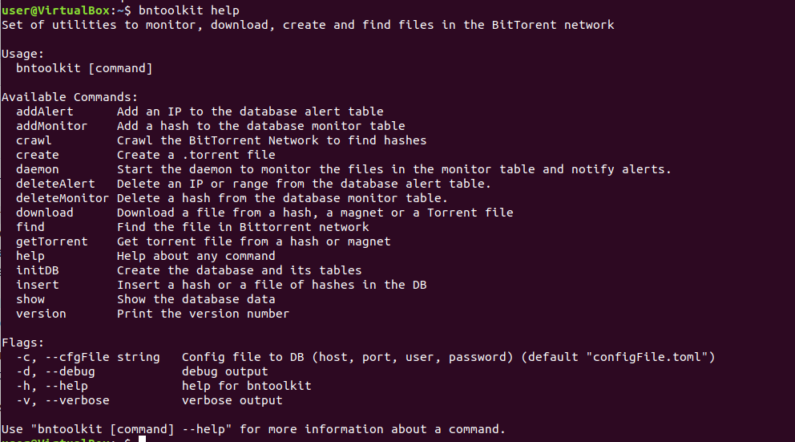

# BNToolkit

[TOC]


## Install

### Install Docker 

```bash
sudo apt install apt-transport-https ca-certificates curl software-properties-common
curl -fsSL https://download.docker.com/linux/ubuntu/gpg | sudo apt-key add -
sudo add-apt-repository "deb [arch=amd64] https://download.docker.com/linux/ubuntu bionic stable"
sudo apt update
sudo apt install docker-ce
```

REF: https://www.digitalocean.com/community/tutorials/como-instalar-y-usar-docker-en-ubuntu-18-04-1-es


### Install Golang

``` bash
sudo apt-get update
sudo apt-get -y upgrade
wget https://dl.google.com/go/go1.12.9.linux-amd64.tar.gz #Check latest in https://golang.org/dl/
sudo tar -xvf go1.12.9.linux-amd64.tar.gz
sudo mv go /usr/local
mkdir ~/work
export GOROOT=/usr/local/go
export GOPATH=$HOME/work
export PATH=$GOPATH/bin:$GOROOT/bin:$PATH
```

REF: https://tecadmin.net/install-go-on-ubuntu/

### Install bntoolkit

#### From github (if it's public)

``` bash
go install github.com/RaulCalvoLaorden/bntoolkit
```

#### From local file

``` bash
cp -r BNToolkit /home/user/work/src/github.com/RaulCalvoLaorden/bntoolkit
cd /home/user/work/src/github.com/RaulCalvoLaorden/bntoolkit
go get .
```

ORcreate

``` bash
bash installLocal.sh
```

``` bash
#!/bin/bash
mkdir -p ~/work/src/github.com
cp -r * ~/work/src/github.com/
cd ~/work/src/github.com/RaulCalvoLaorden/bntoolkit/
ls
go get .
go install
bntoolkit
```

### Execute 

#### Start PostgreSQL

```bash
mkdir ~/postgres
sudo docker run -d -p 5432:5432 --mount type=bind,source=$HOME/postgres/,target=/var/lib/postgresql/data --name hashpostgres -e POSTGRES_PASSWORD=postgres99 postgres
```

#### help

Help about any command

``` bash
bntoolkit help 
```



#### version

Print the version number

```bash
bntoolkit version
```

#### initDB

Create the database and it's tables

```bash
bntoolkit initDB
```


#### create

Create a .torrent file. You can specify the output file, the pieze size, the tracker and a comment

``` bash
bntoolkit create go1.12.9.linux-amd64.tar.gz -o output
```


#### download

Download a file from a hash, a magnet or a Torrent file. 

``` bash
bntoolkit download e84213a794f3ccd890382a54a64ca68b7e925433
```


#### getTorrent

Get torrent file from a hash or magnet. 

``` bash

```

#### addAlert and deleteAlert

Add an IP or range to the database alert table and remove it.

```bash

```

``` bash

```

#### addMonitor and deleteMonitor

Add a hash to the database monitor table and remove it.

```bash

```

``` bash

```

#### crawl

Crawl the BitTorrent Network to find hashes and storage it in the DB.

``` bash

```

#### daemon

Start the daemon to monitor the files in the monitor table, notify alerts and optionally crape DHT

``` bash

```

#### find

Find the file in Bittorrent network using the DHT, a trackers list and the local database. In this command the hashes can be: Possibles, Valid or Downloaded. The first are the ones that could exist because they are valid, the second are the ones that have been found in BitTorrent and the third is that it has peers and can be downloaded.

``` bash

```

#### insert

Insert a hash or a file of hashes in the DB.

``` bash

```

#### show

Show the database data

``` bash

```


